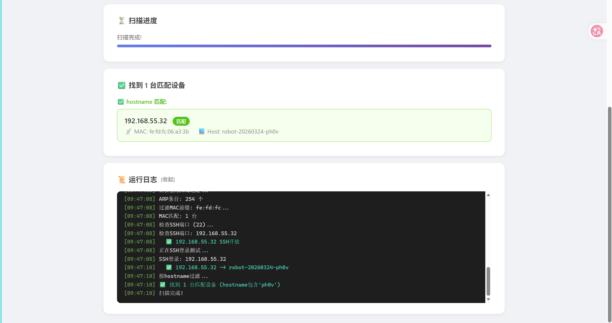

# 局域网设备扫描工具 (LAN Scanner) v2.1

基于 Web 界面的局域网设备扫描工具，用于快速发现和识别指定子网中的设备。

## 功能特点

- **Web 界面操作**：浏览器打开即可使用，无需命令行
- **可配置子网**：支持任意 /24 网段扫描（如 `192.168.1.x`、`192.168.2.x`）
- **MAC 地址过滤**：按 MAC 前缀筛选特定厂商或类型的设备
- **SSH 端口预检**：先用 socket 快速检测端口可达性，再对开放设备进行 SSH 登录，大幅减少等待时间
- **SSH 登录验证**：尝试使用指定凭据登录，获取设备 hostname
- **Hostname 过滤**：按关键字筛选目标设备
- **可随时停止**：扫描过程中可随时点击停止，各阶段立即响应
- **实时统计面板**：存活主机、候选设备、SSH 登录、匹配设备数量一目了然
- **阶段进度条**：6 段进度指示器，直观展示扫描所处阶段（Ping → ARP → MAC 过滤 → 端口检测 → SSH 登录 → Hostname）
- **一键复制 IP**：结果卡片支持点击复制设备 IP
- **键盘快捷键**：`Ctrl+Enter` 开始扫描，`Ctrl+S` 停止扫描
- **实时日志**：终端风格日志区域，支持清空和复制

## 界面截图




## 使用方法

### 快速启动

双击 **`启动扫描工具.bat`**，程序会自动：

1. 检测 Python 3.12 环境
2. 安装依赖（Flask + Paramiko）
3. 后台启动 Web 服务器
4. 等待服务器就绪后自动打开浏览器

> 控制台窗口请保持开启，关闭即退出程序。

### 手动启动

```bash
pip install flask paramiko
python lan_scanner_web.py
```

或使用 Python 启动器（推荐，自动选择最新 Python 版本）：

```bash
py -3.12 -m pip install flask paramiko
py -3.12 lan_scanner_web.py
```

然后浏览器打开 `http://127.0.0.1:5800`。

## Web 界面配置

| 参数 | 说明 | 默认值 |
|------|------|--------|
| 子网 | 目标网段前 3 段 | `192.168.1` |
| MAC 前缀 | 只扫描此 MAC 开头的设备 | `fe:fd:fc` |
| SSH 用户名 | SSH 登录用户名 | `cat` |
| SSH 密码 | SSH 登录密码 | `temppwd` |
| SSH 端口 | SSH 服务端口 | `22` |
| Hostname 过滤 | 只显示 hostname 包含此关键字的设备 | `ph0v` |
| 跳过 MAC 过滤 | 勾选后对所有存活主机尝试 SSH | 不勾选 |

点 **"开始扫描"** 即可，扫描完成后匹配的设备会高亮显示。

## 扫描流程

```
Ping 扫描 → 获取 MAC 地址 → MAC 过滤 → SSH 端口预检 → SSH 登录 → Hostname 过滤
```

### 各阶段说明

| 阶段 | 说明 | 并发度 |
|------|------|--------|
| Ping 扫描 | ICMP Ping 探测 /24 子网全部 254 个 IP | 100 线程 |
| 获取 MAC | 并行执行 `arp -a` + `Get-NetNeighbor` (Windows) | 2 路并行 |
| MAC 过滤 | 按 MAC 前缀筛选候选设备 | — |
| 端口预检 | Socket TCP 连接检测 SSH 端口 (1.5s 超时) | 50 线程 |
| SSH 登录 | Paramiko SSH 连接 + 执行 `hostname` (5s 超时) | 20 线程 |
| Hostname 过滤 | 按关键字筛选最终结果 | — |

## 性能优化

相比 v2.0，v2.1 做了以下关键优化：

- **端口预检**：先以 1.5s 超时的 socket 连接过滤掉端口未开放的设备，只对真正开放 SSH 的设备进行 5s 超时的登录验证，大幅减少无效等待
- **并行 ARP**：Windows 上同时运行 `arp -a` 和 PowerShell `Get-NetNeighbor`，不再串行等待
- **可停止扫描**：各阶段检查停止标志，用户点击停止后扫描立即中断
- **MAC 重试优化**：无匹配时仅重试 ARP 表中缺失的 IP，不再全量重扫

## 快捷键

| 快捷键 | 功能 |
|--------|------|
| `Ctrl + Enter` | 开始扫描 |
| `Ctrl + S` | 停止扫描 |

## 文件结构

```
├── 启动扫描工具.bat       # 双击启动
├── lan_scanner_web.py     # Python 后端
├── templates/
│   └── index.html          # Web 前端
├── README.md
└── .gitignore
```

## 环境要求

- Python 3.10+
- Flask
- Paramiko

## License

MIT
